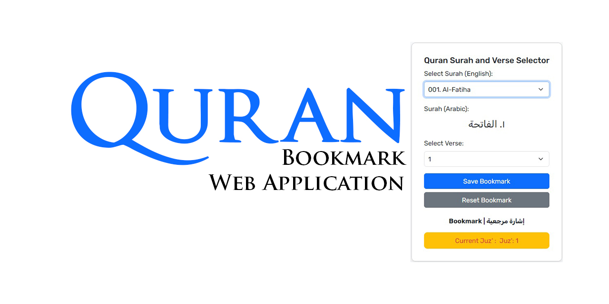

# Quran Bookmark Web Application
_Quran Bookmark Web Application (by Mohamed Arafath)_

> [!Note]
> _Easily select, save, and revisit your favorite Quranic verses. This application allows you to bookmark specific Surahs and Ayahs, keeping your place and making it simple to return to your preferred readings._
> > ~ _Mohamed Arafath_

> [!TIP]
> Helpful advice for doing things better or more easily.

> [!IMPORTANT]
> Key information users need to know to achieve their goal.

> [!WARNING]
> Urgent info that needs immediate user attention to avoid problems.

> [!CAUTION]
> Advises about risks or negative outcomes of certain actions.
